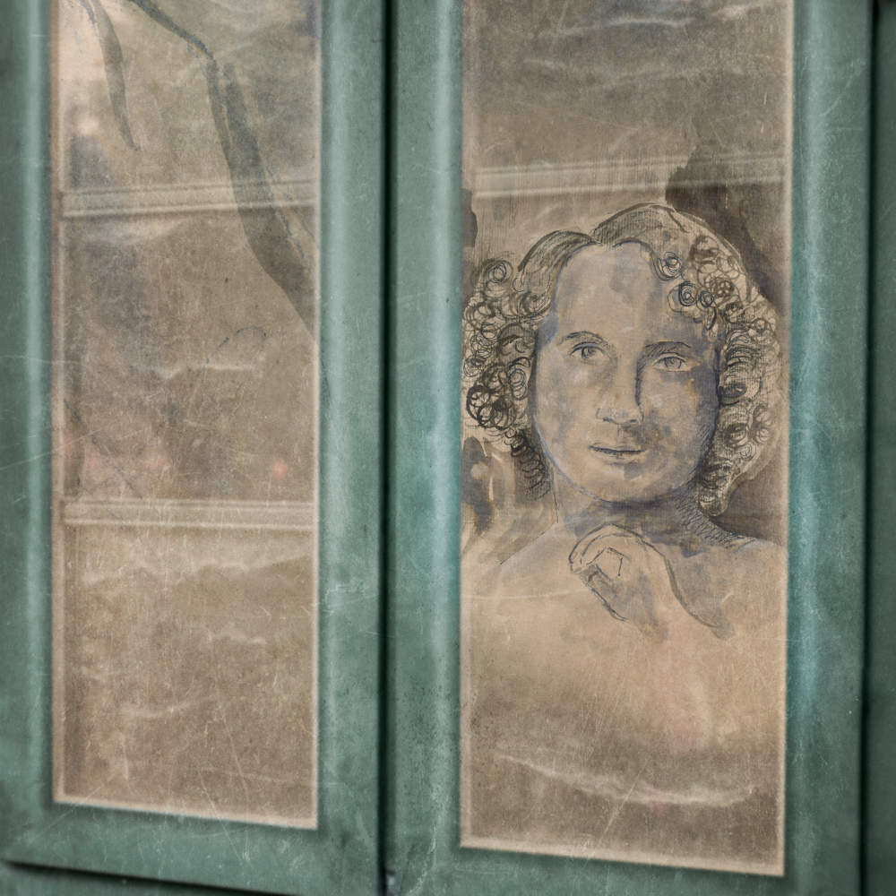
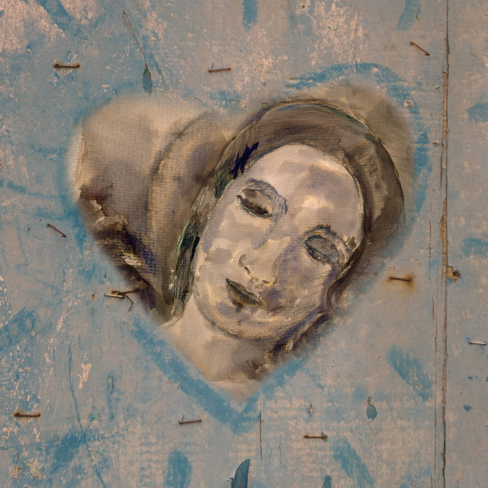

# Debuxos libres

## Debuxos libres

### A xanela de Eros

AUTOR: Elsa Martínez  
TÍTULO: A xanela de Eros  
TÉCNICA: Debuxo a tinta e lapis pastel con tratamento dixital  
DATA: 2018  
LICENZA: Creative Commons BY - SA 4.0  
  
**\*Debuxo inspirado nunha escultura de Luigi Pampaloni na Galería da Academia en Florencia.**  

### Debuxando a Psique

AUTOR: Elsa Martínez  
TÍTULO: Debuxando a Psique  
TÉCNICA: Debuxo a tinta e lapis pastel con tratamento dixital  
DATA: 2018  
LICENZA: Creative Commons BY - SA 4.0  
  
**\*Debuxo inspirado en escultura situada na Basílica de San Miniato al Monte en Florencia.**  

### [Seguinte artigo](fotografias-libres.md)

