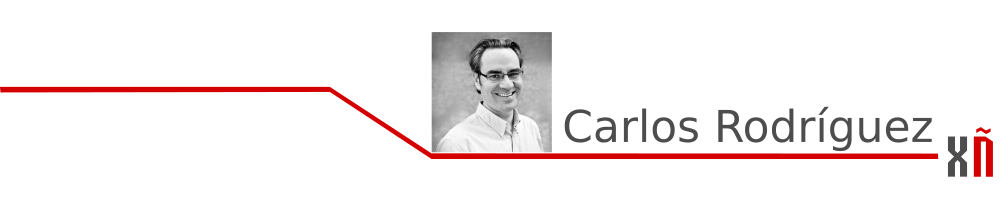

# Empresas explotadoras que «non saen do armario»

## Empresas explotadoras que «non saen do armario»

Estar en contacto con empresas competidoras e sobre todo con aquelas que son máis colaborativas permíteme coñecer máis de preto as tecnoloxías que utilizan para ofrecer os seus produtos e servizos.  
É Software Libre, en maior ou menor medida, **usan Software Libre, pero non todas o din, «non queren saír do armario», aínda.**

O ecosistema de Software Libre é moi variado. Hai xente que xera o código, son as persoas que desenvolven ese software; outras o traducen e adáptano á cultura de cada lugar, son as de localización \(l10n\); tamén hai xente que usa e reporta os erros para melloralo e sometelo a diferentes situacións, sería o equipo de calidade; outras persoas son de deseño e realizan eses grafos, iconas, ou debuxos que emprega o software; e así moita xente máis.  
En xeral son persoas, particulares que se reúnen periódicamente para facer esas «quedadas» tan importantes onde intercambian as súas vivencias, póñense cara e proxectan o futuro dunha ferramenta pola simple motivación de facer algo mellor polo mundo e darllo libremente.

**Comparten coñecemento e non piden nada a cambio.**

Este ecosistema tamén ten as súas necesidades, é xente que come, algunha ten familia e sobre todo gústalle moito o Software Libre e encantaríalle vivir diso. Son persoas que **aman o que fan**. Táchaselles de« anti-sistema», porque non entenden o mundo capitalista estándar…

**Hai dúas cousas que unen ás empresas explotadoras e á Comunidade de Software Libre: o código fonte e o diñeiro.**  
Iso si, cada unha cun enfoque antagonista pero ó fin e ó cabo ambas necesitan deles para subsistir.

As empresas explotadoras, esas que utilizan o código e non o recoñecen, teñen karma negativo, non achegan nada á Comunidade pero lúcranse co Softlware Libre \(para que logo digan que é gratis\). Esta Comunidade á súa vez peca de hippie e de facer as cousas polo «ben común» cando debería ser máis esixente co uso que se fai dos seus desenvolvementos.

**As empresas son as que xeran riqueza, pero esta debe estar ben dirixida cara á Comunidade de Software Libre que é a que xera os recursos que son explotados.**

Como mellorar o karma das empresas?  
De moitas maneiras. Desde que simplemente patrocinen eventos de Software Libre \(non de Open Source, a secas\) ata que contraten a esas persoas da Comunidade que aman o traballo desinteresado que realizan.  
O talento escasea e a demanda é moi alta. Ter no equipo a esas persoas que gozan co que fan é **o mellor regalo que se lle pode facer á Comunidade de Software Libre.**

Carlos Rodríguez García  
**Presidente de AGASOL  
presidencia@agasol.gal**

### [Seguinte artigo](xornadas_usuarios_r.md)

