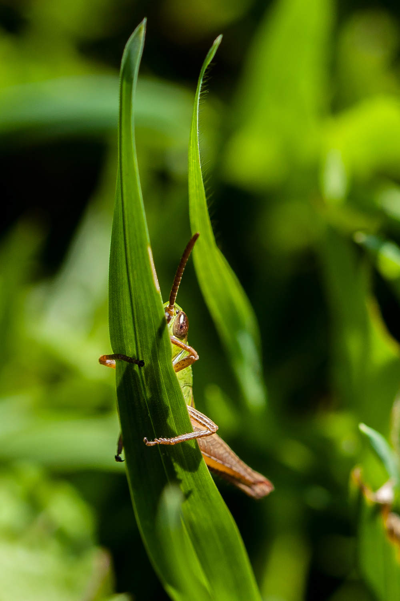
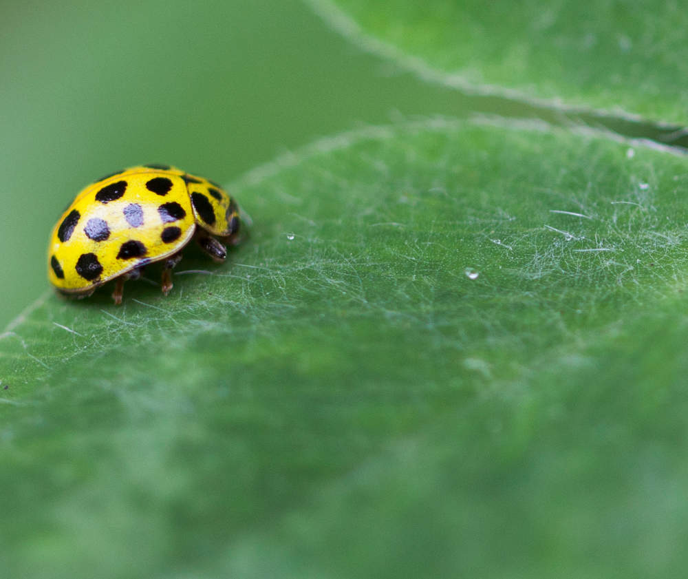
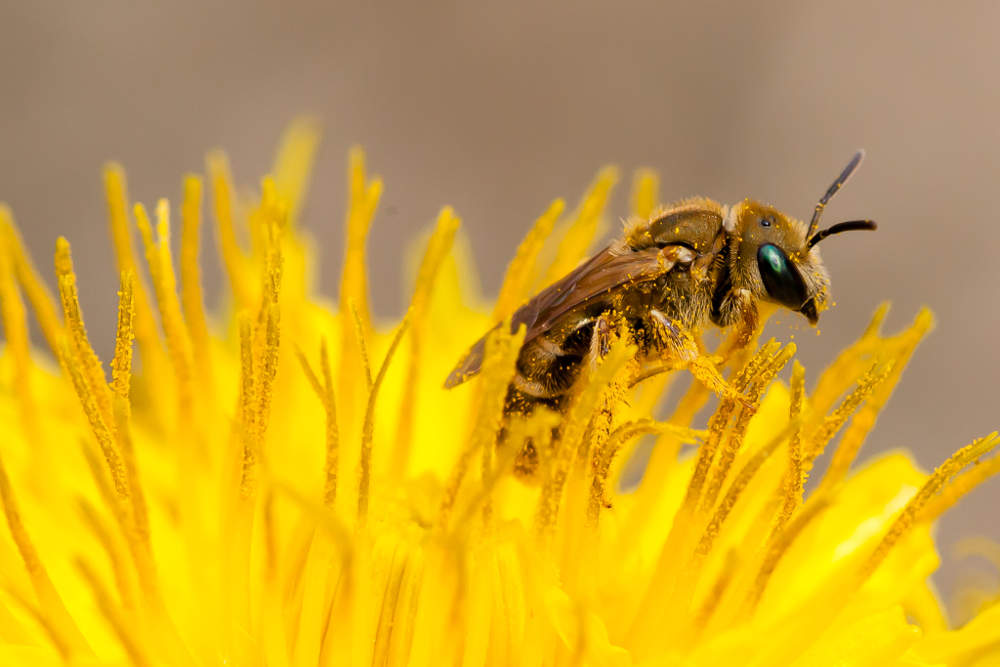
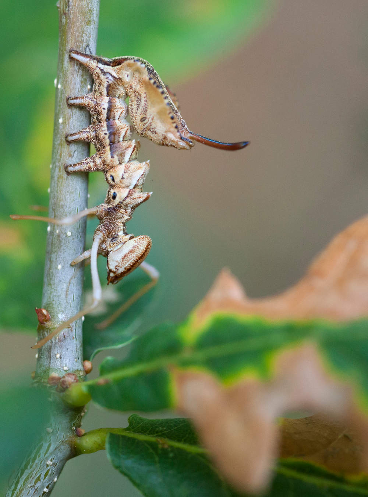

# Fotografías libres

## Fotografías libres

### Saltón

Título: Xogando ás agachadas

No xardín de casa polas mañás, adoito dar un paseo coa cámara para ver si hai algunha sorpresa; e o que moitas veces me atopo, son estes curiosos saltamontes, aínda que sería máis adecuado o adxectivo de tímidos, sempre que se abrazan a algo e a cámara apunta a eles, vanse virando de maneira que me deixan estas imaxes. Sácanche sempre un sorriso neses momentos.

Arquivo coa máxima resolución en Wikimedia Commons: [https://commons.wikimedia.org/wiki/File:Xogando\_as\_agachadas-Guillermo\_Garabatos.jpg\#/media/File:Xogando\_as\_agachadas-Guillermo\_Garabatos.jpg](https://commons.wikimedia.org/wiki/File:Xogando_as_agachadas-Guillermo_Garabatos.jpg#/media/File:Xogando_as_agachadas-Guillermo_Garabatos.jpg)

### Xoaniña

Título: Buscando texturas

A inquietude polas pequenas cousas da natureza, lévame a facer fotos deste tipo; unha pequena mariquita encima dunha folla de trevo, si, as follas de trevo teñen realmente un aspecto sedoso.

Arquivo coa máxima resolución en Wikimedia Commons: [https://commons.wikimedia.org/wiki/File:Buscando\_texturas-Guillermo\_Garabatos.jpg\#/media/File:Buscando\_texturas-Guillermo\_Garabatos.jpg](https://commons.wikimedia.org/wiki/File:Buscando_texturas-Guillermo_Garabatos.jpg#/media/File:Buscando_texturas-Guillermo_Garabatos.jpg)

### Abella

Título: Baño de ouro

Esta foto ten un tempo de espera considerable. Si consideramos o tamaño da flor, un dente de león, facémonos a idea do tamaño do insecto e o detalle das pequenas cousas que se conseguen coa macrofotografía
.

Arquivo coa máxima resolución en Wikimedia Commons: [https://commons.wikimedia.org/wiki/File:Ba%C3%B1o\_de\_ouro-Guillermo\_Garabatos.jpg\#/media/File:Ba%C3%B1o\_de\_ouro-Guillermo\_Garabatos.jpg](https://commons.wikimedia.org/wiki/File:Ba%C3%B1o_de_ouro-Guillermo_Garabatos.jpg#/media/File:Ba%C3%B1o_de_ouro-Guillermo_Garabatos.jpg)

### Eiruga

Título: A beleza do estraño

Esta eiruga de bolboreta nocturna; atopeima nun dos paseos matutinos nun dos montes do municipio de Toques, camuflada nunha folla dun carballo novo. Resultoume asombroso o complicado que foi distinguila; logo dun bo intre observándoa, en movemento gañaba en beleza, entón a instantánea sempre será máis rechamante.

Arquivo coa máxima resolución en Wikimedia Commons: [https://commons.wikimedia.org/wiki/File:A\_beleza\_do\_extra%C3%B1o-Guillermo\_Garabatos.jpg\#/media/File:A\_beleza\_do\_extra%C3%B1o-Guillermo\_Garabatos.jpg](https://commons.wikimedia.org/wiki/File:A_beleza_do_extra%C3%B1o-Guillermo_Garabatos.jpg#/media/File:A_beleza_do_extra%C3%B1o-Guillermo_Garabatos.jpg)

### [Contraportada](contraportada.md)

