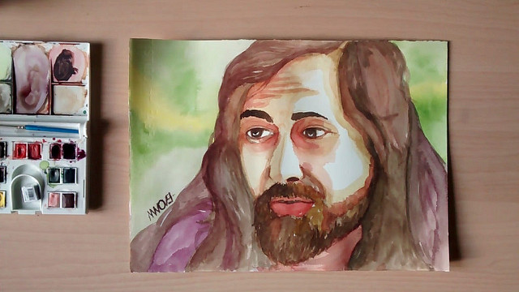
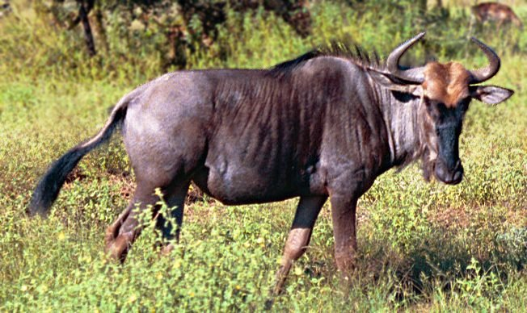

# Dende un cuarto sen xanelas

Soaba de xeito compulsivo na radio daquela clínica de Manhattan o éxito ["Mama, he treats your daughter mean"](https://www.youtube.com/watch?v=HnmbJruEkKw), mentres o Daniel acariñaba coa xema dos seus dedos aínda  temblorosos, ao bebé que, instantes antes a riseira enfermeira situara delicadamente no colo dunha exhausta e feliz Alice.

Aínda non se sabía entón que aquel futuro biólogo vocacional, con certo talento para a matemática e o razoamento lóxico que se habería de matricular en  Harvard buscando unha titulación en física, había de enfrontarse a algún dos seus propios compañeiros de traballo, fundadores da hoxe xa desaparecida  Symbolics  Inc¹, para impedir que tomasen o control dos computadores do MIT Computer Science & Artificial Intelligence Lab², baixo a pouco elegante táctica empresarial de acompañar as correccións e melloras do sistema operativo de máquinas  Lisp³ dunha cláusula prohibindo redistribuír estas modificacións, o que irremediablemente desembocaría, trinta anos despois do lanzamento do éxito de  Ruth  Brown, un 27 de setembro de 1983, na primeira pedra do proxecto GNU, que perseguía a creación dun sistema operativo completamente libre.

Un par de anos despois publicouse o[ Manifesto GNU](https://www.gnu.org/gnu/manifesto.es.html) no que o Richard, aquel fillo de Alice  Lippman e Daniel  Stallman, declaraba as súas intencións e motivacións para crear unha alternativa libre ao sistema operativo  Unix, ao que denominou GNU. Un acrónimo recorrente, como Bing \(Bing is not google\), de reafirmación do que non se é, neste caso, esta claro que o que non é, é  UNIX.

Neste escrito tamén se establecía a desambiguación da fonética do nome que empezara a crear controversia entre os seus seguidores, ¿cómo se pronuncia GNU?.  
Así soubemos dos antílopes artiodáctilos. Unha especie fascinante, marabillosos actores de repartición nos documentais de fauna salvaxe nas sobremesas de verán, máis en concreto merece mención o  [connochaetes gnou](https://es.wikipedia.org/wiki/Connochaetes_gnou) ou  ñu negro. Seguro que a Richard  Matthew, o biólogo vocacional, gustaríalle esta afirmación. 

Outras formulacións da citada declaración sentaban as bases deste movemento social que vai moito máis alá dun sistema operativo e se  enraíza cos principios máis básicos de en que sociedade desexamos vivir, que sociedade desexamos construír, que sociedade desexamos ser, en toda a amplitude do verbo.

E falando de verbos, en concreto dos verbos anglosaxóns, que como en calquera outra lingua, e este dialecto  anglofrísio traído a  Britania polos invasores Xermanos non podía ser doutro xeito, tende á economía da linguaxe.
  
Así na interpretación que de palabras como ' free' faise, caben máis de vinte matices ou significados entre os que poden, con suma facilidade, confundirse libre e gratis. Pero aquí non imos falar de custos, falamos de liberdades. As liberdades que os usuarios e a comunidade merecen ter, a liberdade de executar, copiar, intercambiar, estudar, modificar e mellorar un programa.

Pero tamén, como mencionabamos antes, da corrente de pensamento que promove esta liberdade do contido libre, da cultura libre, que se articula ao redor de conceptos como dominio público, licenzas Creative Commons ou  Copyleft. 

 ¿Chámache a atención?, ¿desexas saber máis?. Camiña comigo, paso a paso neste vieiro, e da man de xente que fixo destes nobres principios bandeira, percorrendo os infinitos fíos da comunidade, probando, preguntando ata achar as respostas a todas as nosas inquietudes ao longo dunha serie de artigos en que profundaremos na cultura e o software libres, as distribucións, o cinema libre, a música libre e o hardware libre. Aprenderemos, e deste xeito, talvez, só talvez, aínda que por un instante sentiremos do mesmo xeito..

### Notas a rodapé

• O primeiro dominio de internet. [http://symbolics.com/](http://symbolics.com/)
  
• Investigación en Intelixencia Artificial, Bioloxía computacional. Robótica. etc.
  
• Lisp: Procesamento de listas. "LISt Processor".

### [Seguinte artigo](empresas_explotadoras.md)

