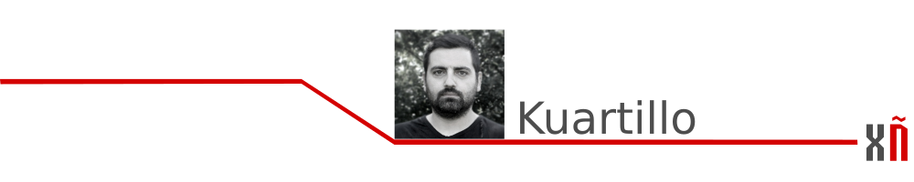
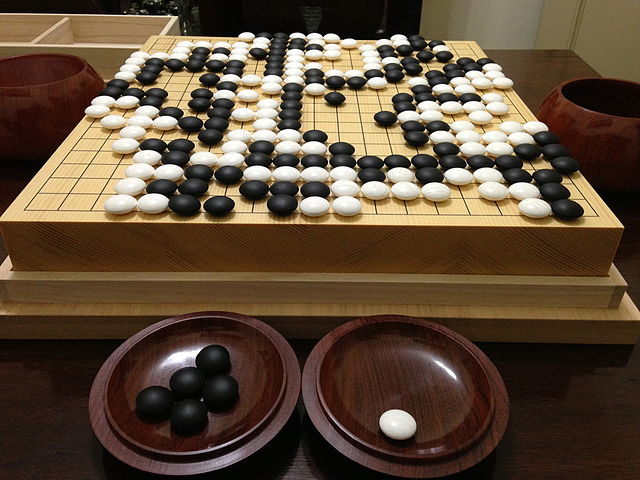
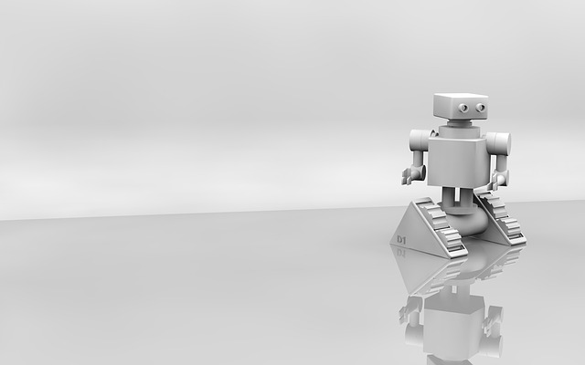

# Ready, steady….GO

### Ready, steady….GO

Todos nalgunha ocasión temos escoitado esta secuencia de berros previos ao comenzo das carreiras de velocidade...pois ben, hoxe non imos falar de atletismo, imos falar da **Intelixencia Artificial** e de como un xogo, o **Go**, foi a excusa perfecta para lograr a sua mellora.

Pode que moitos de vos non coñezades este ancestro xogo de mesa. Segundo a wikipedia o GO é un xogo de estratexia que ten xurdiu en China hai máis de 2500 anos, onde foi considerado unha das catro artes esenciais da sua cultura.  
As regras deste xogo son moi sinxelas, cada xogador ten que rodear coas suas pedras as do seu rival, gaña quen consegue construir un área maior dominada polas suas pedras. 

Dominar este xogo é algo moi compricado pois a hora de decidir onde colocar unha pedra hai que ter en conta moitas cousas, non so puramente matemáticas, **a intuición xoga un papel fundamental neste xogo**, algo que era imposible de conseguir polas máquinas...ata agora.

No 2015 a empresa británica Google DeepMind creou AlphaGo, un programa informático de intelixencia artificial que xoga a GO. Nunca na historia unha máquina foi capaz de vencer a mente humana neste xogo, pois como xa dixemos, non so é importante calcular cal é o mellor sitio onde colocar as pedras para atapar as do rival, a intuición xoga un papel fundamental.

Sen embargo, os creadores de AlphaGo pensaron que o seu programa sería capaz de gañar a mente humana e para demostralo retaron a Fan Hui, o mellor xogador europeo de Go, a máquina gañou sen problemas.

Tal foi o escándalo que os defensores da superioridade humana fronte as máquinas quitaronlle valor a esa victoria, decindo que Fan Hui, non era un xogador de élite.  
Enton, os creadores de AlphaGo retaron a Lee Sedol, o mellor xogador de Go da actualidade. Lee aceptou o reto confiando en gañar a AlphaGo sen problemas...o resultado deste reto foi AlphaGo 4 – Lee Sedol 1.  
A única partida que gañou Lee Sedol foi grazas o que se chamou coma o “movemento divino”, un movemento totalmente inesperado e que segundo os cálculos de AlphaGo so existía 1 entre millons de posibilidades de que un humano a fixera...esto demostra que nese campo, no da improvisación os humanos somos mellores cas máquinas.

Se queres probar a xogar Go existen moitos programas de ordenador que están dispoñibles nos repositorios oficiais, eu persoalmente teño instalado [**qGo**](https://github.com/pzorin/qgo).

### [Seguinte artigo](repositorios-de-software-libre-en-android.md)

