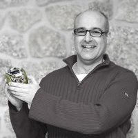
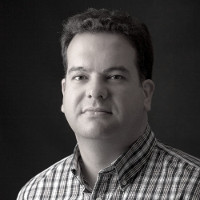
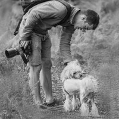

# Artigos

## Artigos

### [ Desde unha habitación sen fiestras](huangho.md)

Breve historia dos antecedentes da xeración ñu inicial

### [Empresas explotadoras que «non saen do armario»](empresas_explotadoras.md)

Artigo de opinión, onde se analiza o ecosistema do Software Libre.

### [Xornadas de Usuarios R en Galicia](xornadas_usuarios_r.md)

Análise das xornadas sobre o programa de estatística que lle gañou o posto ao clásico SPSS.

### [MIT ou GPL, esa é a cuestión](mit-ou-gpl-esa-e-a-cuestion.md)

Se usas Software Libre, apoias e cres que é a mellor opción para o software no futuro e ademais es un desenvolvedor de software, non tes moitas excusas para non liberar cunha licencia de Software Libre.

### [Persoas que difunden a cultura libre, Juan Febles](persoas-que-difunden-a-cultura-libre-juan-febles.md)

Serie de artigos para dar a coñecer a individuos e colectivos, que axudan na difusión ou colaboran de forma significativa na cultura libre.

### [Ready, steady….GO](ready-steady....go.md)

Imos falar da Intelixencia Artificial e de como un xogo, o Go, foi a excusa perfecta para lograr a sua mellora.

### [Repositorios de Software Libre en Android](repositorios-de-software-libre-en-android.md)

**Laboratorio Android**  
É Android software libre?

### [Edición profesional de son con Linux](edicion-profesional-de-audio-con-linux.md)

Introdución: Latencia, Kernel RT \(lowlatency\) e Jack

### [Debuxos libres](debuxos-libres.md)

Debuxos liberados pola autora baixo licenzas libres Creative Commons

### [Fotografías libres](fotografias-libres.md)

Fotos liberadas polo autor baixo licenzas libres Creative Commons

### [Colaboradores](colaboradores.md)

