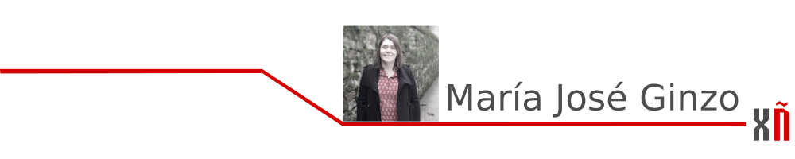
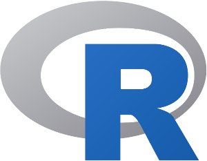
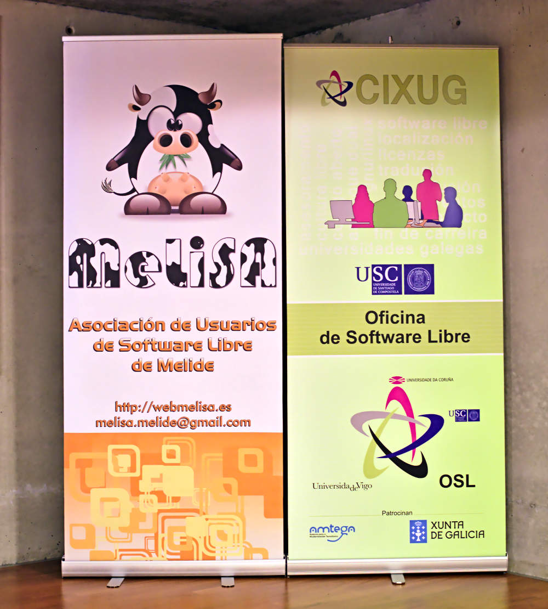
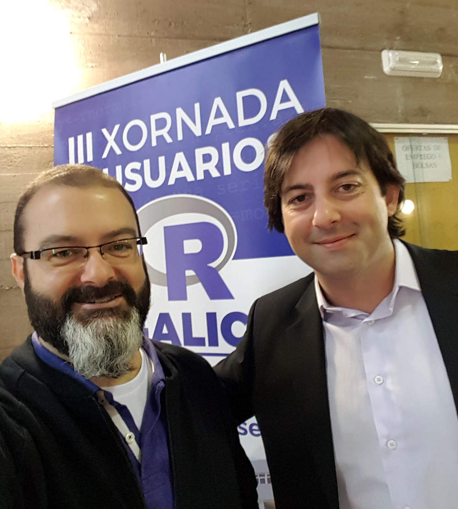
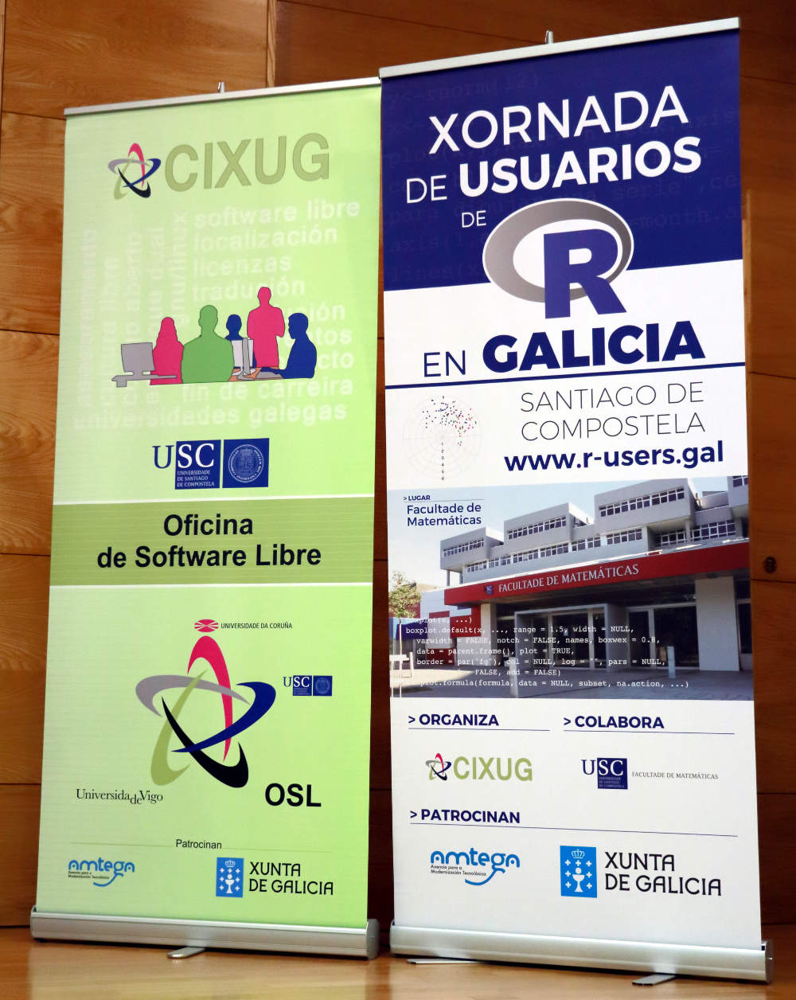

# Xornadas de Usuarios R en Galicia

## Xornadas de Usuarios R en Galicia

**R**, [https://www.r-project.org/](https://www.r-project.org/), para quen non o coñeza, é un programa de estatística que lle gañou o posto de gran alternativa ao clásico SPSS. O paquete estatístico R é unha contorna estatística que inclúe ferramentas de análises de datos e xeración de gráficas. É software libre e funciona baixo Windows, MAC VOS e Linux. R realmente é unha linguaxe e conxunto de módulos estatísticos que, mediante calquera das interfaces de que dispón, permite realizar análises de datos e representación dos mesmos.

A **Comunidad R Hispano**, [http://r-es.org/](http://r-es.org/) ten entre os seus obxectivos o de fomentar o avance do coñecemento e uso da linguaxe de programación en  R e o desenvolvemento da profesión en todas as súas vertentes, especialmente a investigadora, docente e empresarial \(extraído do artigo quinto dos seus estatutos\).

Para elo, a Comunidad organiza conferencias, cursos, sesións de traballo, grupos locais de usuarios, etc, así dende o ano 2009 organiza unhas xornadas de carácter nacional, [http://r-es.org/jornadas/](http://r-es.org/jornadas/). O obxectivo das mesmas é o de proporcionar un punto de encontro aos usuarios de  R, fomentar a colaboración entre eles nun ambiente multidisciplinar, divulgar o coñecemento da linguaxe e as súas posibilidades e promover o uso de  R. As xornadas viñéronse celebrando anualmente e de forma ininterrompida desde o 2009 en diferentes cidades españolas, Murcia no ano 2009,  Mieres en 2010, Madrid 2011, Barcelona en 2012, Zaragoza en 2013, Santiago de Compostela en 2014, Salamanca en 2015, Albacete en 2016 e as últimas no ano 2017 en Granada.

A nivel galego, o 10 de outubro do ano 2013 tivo lugar a **I Xornada de Usuarios R en Galicia**.

Esta xornada naceu co obxectivo de unir a toda a comunidade de usuarios de  R nun mesmo foro en Santiago de Compostela, e coa intención de poñer en común as experiencias e os traballos que se realizan na nosa comunidade autónoma e, desta forma, ter unha visión global das oportunidades e os campos de acción desta ferramenta e interactuar persoalmente cos profesionais que a utilizan.

Na I Xornada de Usuarios R en Galicia contouse coa participación de importantes profesionais do sector da saúde, universitario, investigador e administración pública en xeral e empresarial que son referentes en Galicia no uso deste software, e aberta a que calquera persoa interesada en coñecer  R puidese asistir e participar na mesma.

A primeira edición estivo organizada por MeLiSA \(Asociación de Usuarios e Software Libre de Terra de Melide, [http://www.melisa.gal/](http://www.melisa.gal/) \) dentro das actividades integradas nun convenio asinado coa AMTEGA \(Axencia para a Modernización Tecnolóxica de Galicia\), e contou coa colaboración do CNTG \(Centro de Novas Tecnoloxías de Galicia, [https://emprego.xunta.es/cntxes-pro/](https://emprego.xunta.es/cntxes-pro/)\), OSL \(Oficina de Software Libre, [http://osl.cixug.es/](http://osl.cixug.es/)\) do CIXUG, e a Xunta de Galicia.

Co mesmo obxectivo que a primeira xornada fóronse organizando en 2015 a segunda \(o 1 de outubro\), en 2016 a terceira \(o 19 de outubro\) e en 2017 a cuarta ata o momento \(o 20 de outubro\). Na páxina web [https://www.r-users.gal](https://www.r-users.gal) pódense consultar os programas destas catro edicións. Foron sempre ata a data, xornadas dun día, normalmente cun bloque de conferencias con oradores do estilo da primeira e bloque de formación cun ou dous cursos/talleres, dependendo do ano. Ademais no ano 2014 organizáronse en Santiago as cuartas xornadas nacionais. Toda a información da mesma pódese consultar na páxina web [http://r-es.org/tiki/VI+Jornadas](http://r-es.org/tiki/VI+Jornadas). O comité organizador desta xornada forma parte de forma regular na organización das xornadas galegas.

A II Xornada de Usuarios de R en Galicia celebrouse o día 1 de outubro de 2015. Estivo organizada pola Asociación de Usuarios de Software Libre dá Terra de Melide \(MeLiSA\), e patrocinada pola AMTEGA \(Xunta de Galicia\).

As dúas primeiras xornadas e a cuarta nacional celebráronse no Centro de  Novas  Tecnoloxías de Galicia \(CNTG\) de Santiago de Compostela.

A III e IV  Xornada de Usuarios de  R en Galicia tiveron lugar na Facultade de Matemáticas da Universidade de Santiago de Compostela.

Estas dúas últimas edicións foron organizadas pola OSL - Oficina de Software Libre do  CIXUG e patrocinadas pola AMTEGA.

### Talleres

Os talleres que se impartiron en todas estas sesións foron os seguintes:

        ◦ Creación de paquetes, informes e viñetas con R no ano 2013

        ◦ Visualización de Datos Raster no ano 2014 \(IV jornada nacional\)

        ◦ Modelos preditivos co paquete caret no ano 2014 \(IV jornada nacional\)

        ◦ Visualización de Series Temporais no ano 2014 \(IV jornada nacional\)

        ◦ peRcepción do coloR e visualización en R no ano 2014 \(IV jornada nacional\)

        ◦ Dos datos á publicación científica: R, Markdown & Sweave no ano 2015

        ◦ Introdución a R no ano 2016

        ◦ Reproducibilidade en ciencia con R no ano 2016

        ◦ Introdución a R no ano 2017

        ◦ Web Scraping no ano 2017

Estas xornadas retransmítense en directo e despois publícanse na canle de  Youtube  **R  Users  Gal**, [https://www.youtube.com/channel/UCG1\_1eqe\_KvoVByZeFFFErQ](https://www.youtube.com/channel/UCG1_1eqe_KvoVByZeFFFErQ),  para que estean dispoñibles para toda a comunidade.

### [Seguinte artigo](mit-ou-gpl-esa-e-a-cuestion.md)

